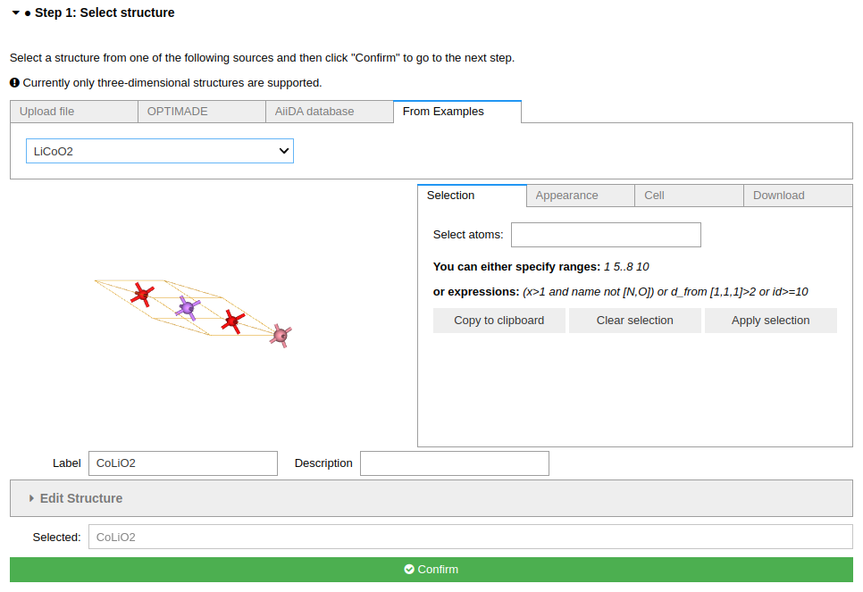
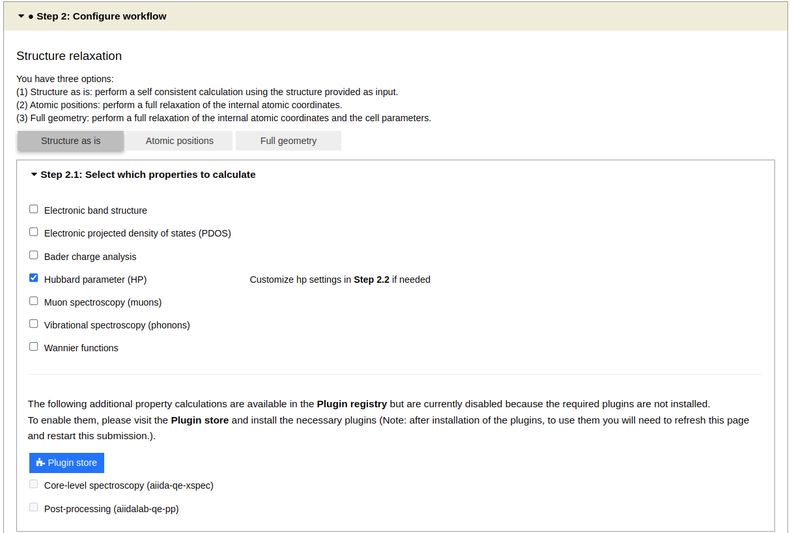
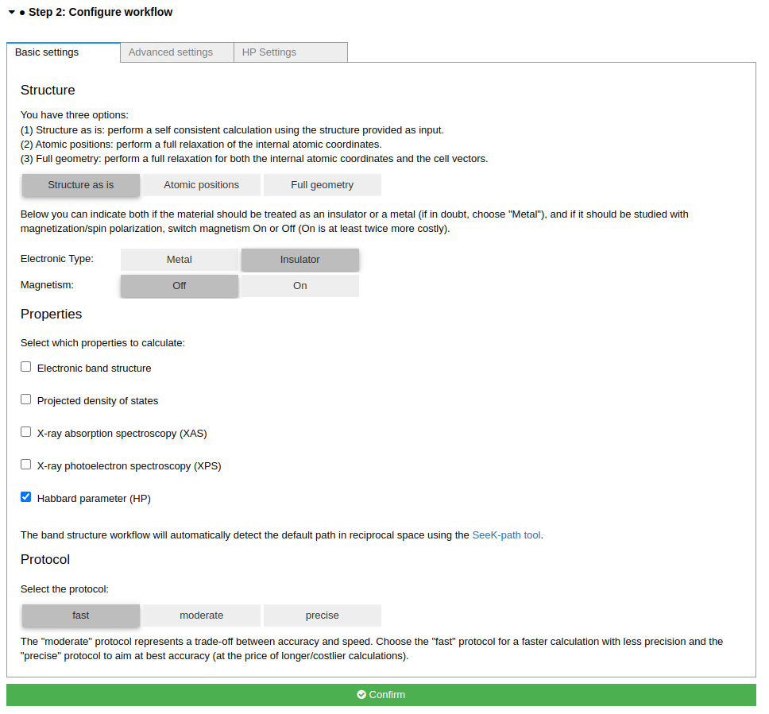
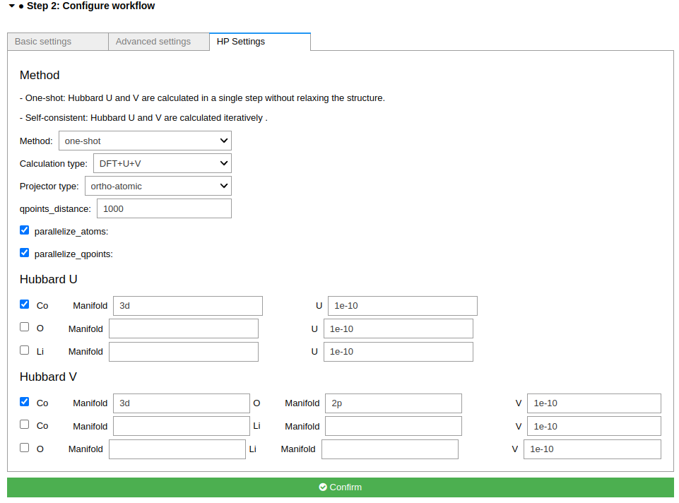
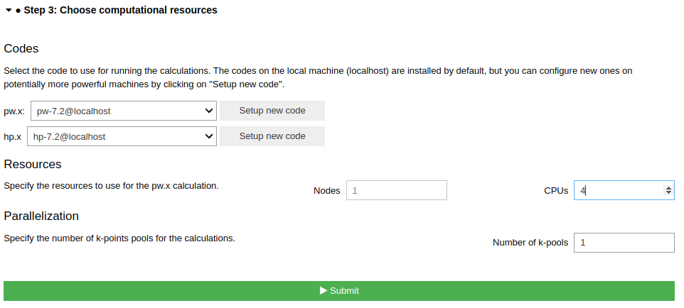

====================================
How to calculate Hubbard parameters
====================================

Overview
========
This tutorial will guide you through the process of setting up and running Hubbard parameters calculation for LiCoO\ :sub:`2`.

Steps
=====

Launch the app, then follow the steps below.

Step 1 Select a structure
--------------------------------
For this tutorial task, please use the `From Examples` tab, and select the LiCoO\ :sub:`2` structure.

Click the `Confirm` button to proceed.

Step 2 Configure workflow
--------------------------------

In the **Configure workflow** tab, set the following parameters:

- In the **Structure optimization** section, select ``Structure as is``.
- In the **properties** section, select ``Hubbard parameter (HP)``

In the **Basic Settings** tab, set the following parameters:

- Set **Electronic Type** to ``Insulator``
- Set **Protocol** to ``Fast``

Then go to the **HP setting** tab and, in the **Select atoms for which on-site Hubbard U must be computed** section, select ``Co`` by ticking the appropriate box.
Set the **Manifold** to ``3d``.
In the **Select couples of atoms for which inter-site Hubbard V must be computed** section, select first row by ticking the appropriate box.
Set the **Manifold** to ``3d`` and ``2p`` for the **Co** atom and **O** atom, respectively.

Click the **Confirm** button to proceed.

Step 3 Choose computational resources
---------------------------------------
In this small system, we can use the default `localhost` computer to run the calculation.

.. tip::
   For large system, we need the high-performance computer to run HP calculation.
   Please read the relevant `How-To <https://aiidalab-qe.readthedocs.io/howto/setup_computer_code.html>`_ section to setup code on a remote machine.

Set the number of CPUs/nodde to 2.

Then, click the **Submit** button.

Step 4 Check the status and results
-----------------------------------------
The job may take 5~10 minutes to finish.

While the calculation is running, you can monitor its status.
When the job is finished, you can view result spectra in the `HP` tab.

.. tip::

   If the `HP` tab is now shown when the jobs is finished.
   Click the ``QeAppWorkChain<pk>`` item on top of the nodetree to refresh the step.

Here is the result of the HP calculation. It includes:
- the Hubbard data for the structure
- the Structure viewer

Click on the row above to highlight the specific atoms couple whose inter-site Hubbard V is being calculated.

.. figure:: /_static/images/hp_step_4_hp_tab.png
   :align: center

Congratulations, you have finished this tutorial!

Another example
====================
Please try another example: NiO.

Questions
=========

If you have any questions, please, do not hesitate to ask on the AiiDA discourse forum: https://aiida.discourse.group/.
